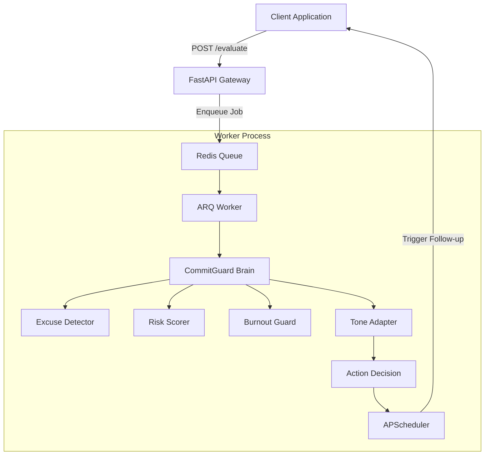

# CommitGuard AI: The Accountability Specialist 🛡️
> **Automation Specialist Angle:** Automating the hardest part of human management using sentiment-aware AI agents.

**"CommitGuard AI provide 'Accountability as a Service.' CommitGuard predicts when a team member is likely to fail *before* the deadline and intervenes with the right behavioral tone to ensure delivery."**

## 🆘 The Problem
In modern distributed teams, the **"Slack Stall"** is the #1 drain on project velocity. Project Managers are overwhelmed by vague promises like *"I'll get to it soon,"* which are often forgotten, leading to missed sprints and "bad guy" escalations.

## ✅ The Solution: CommitGuard AI
CommitGuard AI is a standalone, agentic service designed to monitor and enforce professional commitments. It doesn't just "track tasks"; it acts as a proactive collaborator that:
1. **Extracts Vague Promises**: Automatically parses Slack threads to create structured commitment records.
2. **Predicts Failure**: Uses behavioral sentiment to flag burnout or deflection *before* the deadline passes.
3. **Automates Calibration**: Adjusts its tone—Supportive for burnout, Firm for repeat offenders—saving the PM from having to chase updates.


## 🚀 Key Features
- **Deterministic AI Agents**: Built with `FastAPI`, `instructor`, and `Pydantic` for structured, reliable JSON outputs.
- **Behavioral Analysis**:
  - `ExcuseDetector`: Classifies reasons for commitment failure (Legitimate vs. Deflection vs. Burnout).
  - `RiskAssessor`: Quantifies the probability of failure based on historical context.
  - `ToneAdapter`: Dynamically shifts empathy levels (Supportive → Confrontational) based on performance.
- **Asynchronous Orchestration**: 
  - **Task Queue**: Uses `ARQ` + `Redis` to offload LLM latency from the main API thread.
  - **Accountability Scheduler**: Uses `APScheduler` for precision, time-sensitive follow-up actions.
- **Elite Modular Architecture**: Pluggable **LLM Provider Factory** supporting OpenAI, Claude (Anthropic), and hermetic mock providers.
- **Identity Attribution**: Specialized logic to automatically extract commitment "Owners" from raw thread text.
- **Production Observability**: Structured JSON logging (`structlog`) and metrics instrumentation (`Prometheus`).
- **Resilient Test Suite**: Comprehensive `pytest` suite with **Mock Providers**, ensuring 100% reliability in offline environments.


## 🏗️ Architecture: Asynchronous Agentic Worker Pattern

In production high-volume environments, we never block the user request for AI reasoning. CommitGuard AI uses an **event-driven architecture** where the API acts as a gateway and background workers handle the "Brain" logic.



### Technical Significance:
1. **Vendor Agnostic**: Swap LLM providers (from OpenAI to Claude or local Llama) in 2 seconds via configuration.
2. **Deterministic Outputs**: Every agent uses Pydantic-enforced schemas to guarantee reliable downstream processing.
3. **Latency Decoupling**: The user receives a 202 Accepted response instantly, while the asynchronous worker handles reasoning out-of-band.
4. **Identity Attribution**: The agent doesn't just extract tasks; it identifies the specific human owner responsible for the commitment.

## 💬 Slack Integration Guide

### How to use it:
CommitGuard AI acts as a **Proactive Accountability Partner** in your workspace.

1.  **Setup**: The manager creates an [Incoming Webhook](https://api.slack.com/messaging/webhooks) for your project channel.
2.  **Configuration**: Add the URL to your `.env`:
    ```bash
    SLACK_WEBHOOK_URL="https://hooks.slack.com/services/..."
    ```
3.  **Automated Intervention**: 
    - When the developer updates the system with an excuse (via the `/evaluate` endpoint), the agent analyzes their history and sentiment.
    - If the risk is **High** or **Critical**, CommitGuard will autonomously post a formatted "Burnout Alert" or "Accountability Warning" to the Slack channel.
    - **Result**: You save 1-2 hours of manual follow-up time every day.


## 💡 API Usage Examples

### 1. Ingest a Raw Slack Promise
Automatically extracts who, what, and when from natural language.
```bash
curl -X 'POST' \
  'http://localhost:8000/ingest/raw?user_id=john_dev&raw_text=I%20promise%20to%20fix%20the%20CSS%20bugs%20by%20tomorrow%20evening' \
  -H 'accept: application/json'
```

### 2. Evaluate a User Check-in
Triggers the agentic reasoning pipeline (Excuse analysis -> Risk Assessment -> Burnout Detection -> Notification).
```bash
curl -X 'POST' \
  'http://localhost:8000/evaluate' \
  -H 'accept: application/json' \
  -H 'Content-Type: application/json' \
  -d '{
  "user_id": "john_dev",
  "commitment": "fix the CSS bugs",
  "check_in": "I am almost there but honestly I am extremely tired and might need more time"
}'
```

---

## 🛠️ Tech Stack

- **Framework**: FastAPI (Python 3.12+)
- **LLM Orchestration**: Instructor + Pydantic
- **Message Broker**: Redis
- **Task Queue**: ARQ
- **Job Scheduling**: APScheduler
- **Logging**: Structlog
- **Metrics**: Prometheus

## 🚦 Getting Started

### 1. Local Development (Poetry)
```bash
# Start Infrastructure
docker-compose up -d

# Start API
poetry run uvicorn src.main:app --reload

# Start Worker
poetry run arq src.worker.WorkerSettings
```

### 2. Production (Docker)
```bash
docker-compose up --build
```

---

*Built by [daretechie](https://github.com/daretechie) as a demonstration of high-ticket AI Agent Architecture.*
