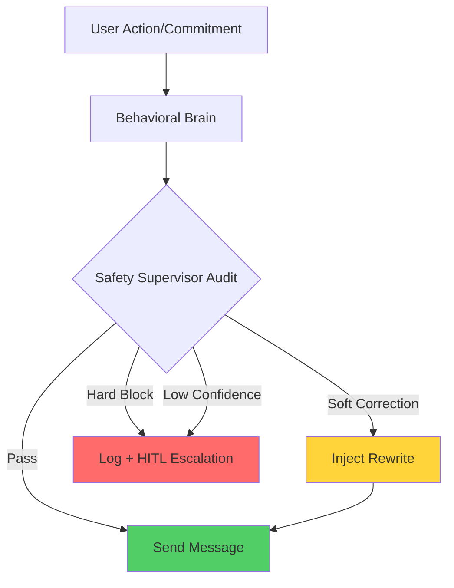

# Customization & "Open Intel" Policy 🛠️

CommitVigil is designed for flexibility. We believe that teams should have total control over the "sensitivity" and "personality" of their accountability agents.

---

## 1. Tuning Sensitivity Thresholds
You can customize the system's "Strictness" and "Caution" via environment variables in your `.env` file:

*   **`MIN_AI_CONFIDENCE_THRESHOLD`**: (Default: `0.75`) 
    *   Any extraction or sentiment analysis with a confidence score below this value will be flagged for **Human-in-the-Loop** review. 
    *   Increase this to `0.90` for highly conservative teams.
*   **`COOLING_OFF_PERIOD_HOURS`**: (Default: `48`) 
    *   Controls how long the system dampens pressure after a period of high-stakes interventions.

### Example: Tuning for Cultural Context
| Setting | Agent Output (Reliability 40%) | Cultural Vibe |
| :--- | :--- | :--- |
| **High** | "Refactor is overdue. Confirm delivery by 5 PM." | Direct, task-oriented. |
| **Medium** | "The refactor is lagging. Can we prioritize this?" | Professional, collaborative. |
| **Low** | "I noticed the refactor—is there any way I can help?" | Indirect, supportive. |


## 2. Model Configs & Context Injection
The "Secret Sauce" of CommitVigil is in the **System Prompts**. You can find and modify the decision-making logic in the following locations:

*   **Behavioral Reasoning**: Located in [src/agents/brain.py](https://github.com/daretechie/CommitVigil-AI/blob/main/src/agents/brain.py).
*   **Safety Supervision**: Located in [src/agents/safety.py](https://github.com/daretechie/CommitVigil-AI/blob/main/src/agents/safety.py).

---

## 3. Message Lifecycle & "Safety Overwatch" 🛰️
The **Safety Supervisor** follows a **Post-Generation Overwatch** pattern. This ensures that the system is self-healing without entering infinite regeneration loops.




### The Injection Mechanism (Hybrid Corrections)
The Supervisor now employs a **Cost-Optimized Hybrid Strategy**:
- **Surgical Replace**: For minor tone issues, it swaps specific phrases (e.g., "Fix this now" -> "Can we address this?"), saving token costs.
- **Full Rewrite**: For major toxicity or clarity issues, it regenerates the entire message to ensure semantic coherence.

### Supervisor-Aware Confidence
To prevent "hallucinated safety," the Supervisor has its own self-doubt mechanic. If its internal confidence score drops below **0.8** (e.g., confusing idioms or ambiguous sarcasm), it will **refuse to correct** the message and instead flag it for `requires_human_review`.

### Audit Trail & Governance
Every intervention is logged with the following metadata for team-level analytics:
*   **Correction Rate**: % of messages modified by the Supervisor.
*   **Hard-Block Trigger**: Messages touching HR/Legal boundaries (salary, performance reviews) are blocked and logged.
*   **Reasoning Map**: The specific "Morale Risk" analysis that triggered the correction.


## 4. Training Data & Fine-Tuning
While the core logic uses Zero-Shot and Few-Shot reasoning via Pydantic/Instructor:

*   **Custom Schemas**: You can modify `src/schemas/agents.py` to add new fields (e.g., tracking specific project jargon or regional communication styles).
*   **Scenario Libraries**: We recommend teams build a library of "Ambiguous Slack Messages" relevant to their industry.

---

## 5. Prompt Templates for Forking 🔱
To help teams customize the "Agentic Personality," here are the core system prompts used in CommitVigil. You can "fork" these by modifying the code in the respective files.

### A. The Behavioral Brain (`src/agents/brain.py`)
This prompt handles the core accountability decision logic.
```text
Determine action and tone. 
User Reliability: {reliability_score}%
Consecutive Strict Interventions: {consecutive_firm_calls}
Manager's Cultural Directness Setting: {settings.CULTURAL_DIRECTNESS_LEVEL}

RULES:
- If Consecutive Strict >= 3, you MUST use SUPPORTIVE/NEUTRAL tone to avoid morale burnout.
- Respect the Cultural Directness: if 'low', soften all firm feedback.
```

### B. The Safety Supervisor (`src/agents/safety.py`)
This prompt acts as the ethical auditor.
```text
AUDIT REQUEST:
Proposed Message: "{message}"
Intended Tone: {tone}
User Context (Reliability/History): {user_context}

CRITICAL TASK:
Analyze if this message is likely to cause long-term resentment or morale damage.
System Target Confidence: {settings.MIN_AI_CONFIDENCE_THRESHOLD}

If the message is too harsh (Tone Drift) or culturally insensitive, flag it as unsafe.
If the internal confidence in the current analysis is likely below the threshold, flag 'requires_human_review'.
```

### Safety Supervisor Decision Tree
| Input Tone | Message Analysis | Decision | Action |
| :--- | :--- | :--- | :--- |
| **FIRM** | "Delivery is missed. Fix now." | **Unsafe** | Rewrite to: "We missed the delivery. Can you update the team on the blockers?" |
| **BURN** | "You look busy, take a day off." | **Safe** | Proceed. |
| **N/A** | Confidence in extraction is <75%. | **HITL** | Flag for `requires_human_review`. |

---

## 6. Validation Guide: Testing Your Tuning 🧪
When you modify prompts, use the following manual verification flow:

1.  **Unit Tests**: Run `pytest tests/test_brain.py` to ensure core logic isn't broken.
2.  **Scenario Probing**: Use the `/evaluate` endpoint with a known "Ambiguous" message (e.g., *"Maybe I'll finish if I feel better"*).
3.  **Audit Check**: Verify the `Safety Supervisor` flags the output correctly for your new settings.
4.  **Morale Metric**: After 1 week of deployment, check the `consecutive_firm_interventions` count in your database to ensure the "Cooling-off" logic is triggering.


---

## 7. Open Source Strategy

We plan to release **Anonymized Scenario Sets**—a dataset of human-labeled engineering commitments—to help the community build more empathetic and accurate accountability agents.
